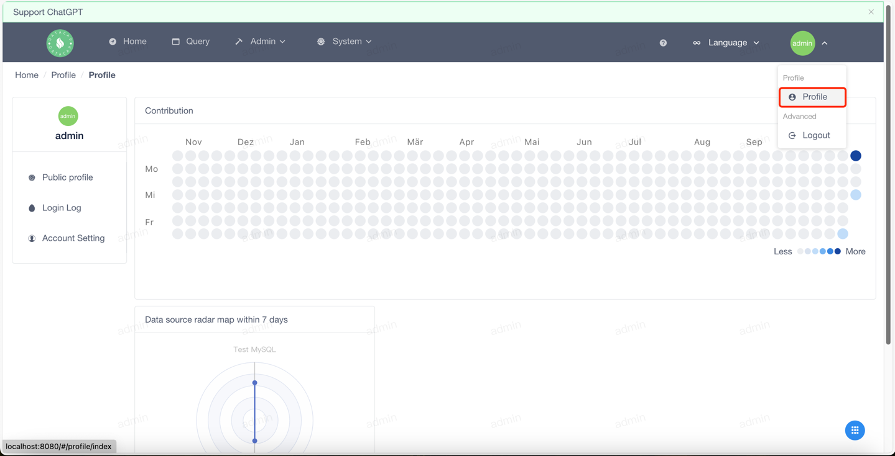
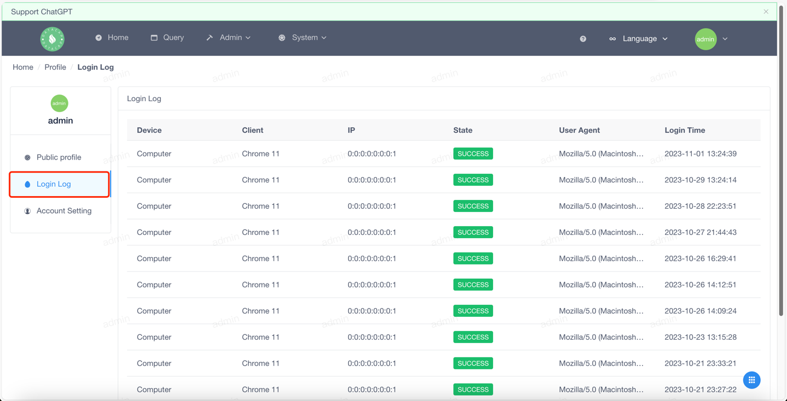
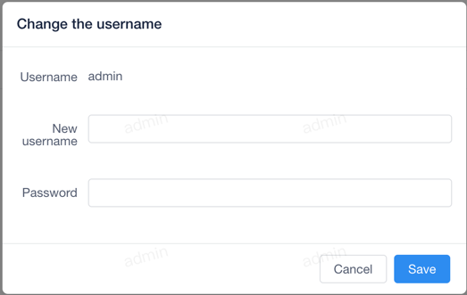
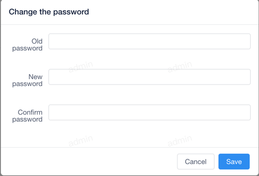
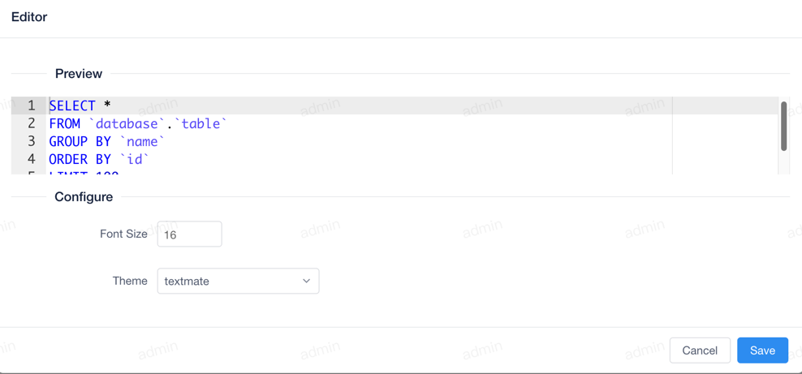

!!! note

    通过个人资料功能，可以对个人用户的一些查询历史和数据源的使用进行一些概览查看。

鼠标移向顶部菜单的最右侧的头像菜单，会弹出下拉框，点击下拉框中的第一个子菜单。弹出类似如下窗口：

首先我们看到的最上面的一个图表是近一年的查询日历图。它根据每天的查询总数汇总来计算。

第二个图表是近7日的数据源使用情况。它根据每天的数据源使用情况汇总来计算。

### 个人资料

---

当点击个人资料按钮后（也就是左侧菜单的第一个按钮），会弹出如下窗口：

该页面主要展示了个人资料的基本信息。

### 登录日志

---

当点击登录日志按钮后（也就是左侧菜单的第二个按钮），会弹出如下窗口：

该页面主要展示了当前用户的详细登录日志，包括了登录时间、登录地点、登录方式等。

### 账号设置

---

当点击账号设置按钮后（也就是左侧菜单的第三个按钮），会弹出如下窗口：

该页面主要展示了一些用户可以进行的配置功能。

#### 用户名

---

当点击修改用户名按钮后，会弹出如下窗口：

输入修改后的用户名和当前密码，点击确定按钮即可完成修改。

!!! danger

    需要注意的是：修改用户名后，需要重新登录。系统会默认退出当前账号。

#### 密码

---

当点击修改密码按钮后，会弹出如下窗口：

输入原密码和新密码，点击确定按钮即可完成修改。

!!! danger

    需要注意的是：修改密码后，需要重新登录。系统会默认退出当前账号。

#### ChatGPT

---

当点击 ChatGPT 按钮后，会弹出如下窗口：

该页面主要展示了一些 ChatGPT 可以进行的配置功能。

#### 编辑器

---

当点击编辑器按钮后，会弹出如下窗口：

在修改编辑器时，修改的配置会同步到系统中的所有用到编辑器的位置。

编辑器的修改是所见即所得的状态，可以实时显示出来当前的配置方案。
